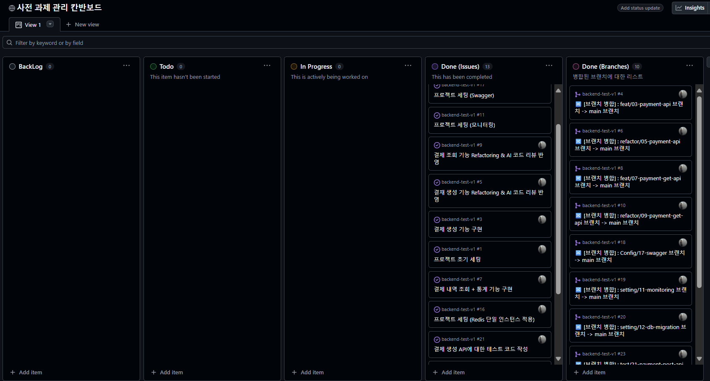

# 개요

안녕하세요 !   
빅스페이먼츠 과제 테스트에 참여한 백엔드 개발자 류성열입니다.

먼저, 부족한 제게 귀중한 기회를 주셔서 너무나도 감사하다는 말씀을 드립니다.   
Kotlin, 헥사고날 아키텍처, 결제 시스템에 대한 도메인 지식이 부족했지만, 기회를 소중히 여겨 짧은 시간 열심히 결제 시스템 도메인과 Kotlin을 공부해서 다음 결과를 창출했습니다.

### 구현 과정은 다음 Notion 페이지,PR 기록, 칸반보드에 상세히 기록하였습니다.  
1. Notion : 
[https://butternut-ounce-9c0.notion.site/28c85b8cc92d80f6b25ee54e9bb240dd?source=copy_link](https://www.notion.so/28c85b8cc92d80f6b25ee54e9bb240dd?pvs=21)

2. PR 기록 : https://github.com/passionryu/backend-test-v1/pulls?q=is%3Apr+is%3Aclosed

3. 칸반 보드 : https://github.com/users/passionryu/projects/2

## 간단한 사용 가이드
Root 디렉토리 아래에 infra 디렉토리가 있습니다.   
그 안에 다음과 같이 디렉토리를 구현해놨습니다.   
1. cache -> Redis 기반의 캐시 서버
2. database -> postgreSQL 기반 RDB 
3. monitoring -> prometheus, grafana 기반의 모니터링 툴 

Monitoring 툴은 필수로 가동 시킬 필요는 없으며, cache/database 디렉토리 내부에서 docker-compose.yml 파일을 실행시킨 후,    
Spring Boot 서버를 실행하면, DB와 Cache 서버가 연결이 됩니다.

서버를 실행 시킨 후 Swagger에 대한 접속 링크는 다음과 같습니다.   
링크 : http://localhost:8080/swagger-ui/index.html

모니터링 툴 (아이디/비밀번호 : admin/1111)

## 구현 범위

1. 프로젝트 및 요구사항 분석
2. 도메인 공부 (결제 시스템 용어 정리, 결제 시스템에서 중시하는 아키텍처 등등 문서화 정리)
3. 결제 생성 API 구현
4. 결제 조회 API 구현
5. 결제 생성 API에 대한 테스트 코드 작성
6. 결제 조회 API에 대한 테스트 코드 작성
7. Prometheus, Grafana를 활용한 모니터링 스택 적용
8. PostgreSQL을 활용한 외부 DB 선언
9. LiquiBase Tool을 활용한 DB 마이그레이션
10. Redis 기반의 커스터마이징 캐싱 시스템 적용
11. 최종 문서화 

## 프로젝트 방법론
다음과 같은 프로젝트 진행 방법론에 따라서 진행했습니다.

- 코드 컨벤션 : Kotlin Naming Convention
- 커밋 컨벤션 : Gitmoji를 활용한 한국어 기반 커밋 
- 브랜치 컨벤션 : <타입>/<번호>-<간결한설명>
- 문서화 방법 :  Notion 활용
- PR 템플릿 활용 : .github 디렉토리 아래 PR 자동 탬플릿 적용 스크립트 추가
- 코드 리뷰 : Code Rabbit AI를 활용한 코드 리뷰

## 만약, 시간이 더 있었다면,
안정성이 중요한 결제시스템의 DB에 CQRS 패턴과 Primary-Replica 구조를 적용하여 대규모 트래픽을 제어할 것이고,     
Patroni&etcd 기반의 Fail-Over 시스템을 통해 HA를 보장하였을 것입니다.   

이에 대한 연구와 기록은 다음 페이지에 평소에 하고 있었습니다.   
대규모 트래픽 연구 프로젝트 문서화 링크 : https://knotty-toast-80a.notion.site/26b1979809dd800681eff595e8dbe3bd?source=copy_link     
대규모 트래픽 연구 프로젝트 Github 링크 : https://github.com/Research-Project-rsy/SessionServer

부족한 제게 귀중한 기회를 주셔서 다시 한번 너무나도 감사하다는 말씀을 드립니다.
